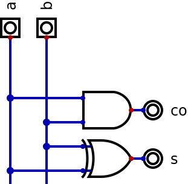
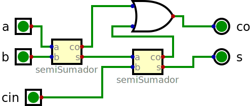

# Simulación de circuitos digitales

## Introduccion
En el informe presentado a continuación se desarrollará la práctica relacionada con la simulación de circuitos digitales, en donde se buscara conocer el potencial del lenguaje de descripción de hardware Verilog en la elaboración de circuitos y en la correspondiente verificación de ellos. Durante el informe se usaran programas de Linux para cada uno de los procesos, empezando por programas como iverilog que permite la simulación de archivos verilog y gtkwave que permite observar los resultados graficamente. Adicionalmente con la ayuda de digital se realizaran los circuitos digitales a partir de compuertas logicas, tablas de verdad y expresiones algebraicas, para acomparar al final los resultados obtenidos.

## Objetivos

1. A partir de la documentación de Digital identificar las capacidades de ésta aplicación, limitaciones, herramientas y ejemplos de uso.

2. Observar de la simulación de un circuito digital:
    * Tabla de verdad
    * Expresión algebraica asociada al circuito
    * Mapa de Karnaugh
    * Simulación
    * Casos de prueba

3. Realizar la simulación del circuito digital con iverilog y gtkwave
    * Describir el circuito digital en verilog
    * Crear el testbench de los casos de prueba
    * Realizar la simulación
    * Observar en gtkwave los resultados de manera gráfica

4. Combinar Digital, iverilog y gtkwave
    * En digital con el circuito anterior
        * Exportar a verilog
        * Crear un testbench con los casos de prueba
    * En iverilog crear la simulación con los archivos generados archivo.v y tb.v0
    * En gtkwave observar los resultados de la simulación

## Procedimiento

En el desarrollo de los circuitos se utilizara Digital, iverilog, gtkwave, yosys y netlistsvg, para cumplir los objetivos propuestos anteriormente. Inicialmente se buscara comprender todo el potencial de la aplicación digital y con lo aprendido se obtendra la tabla de verdad, la expresión algebraica, el mapa de Karnaugh y se realizara la simuación correspondiente con sus casos de prueba. Se desarrollara el circuito en verilog para simularlo con iverilog y con gtkwave. Por ultimo, se comparan los resultados de la simulación del archivo verilog que se obtiene desde digital con iverilog y gtkwave.

## Resultados

