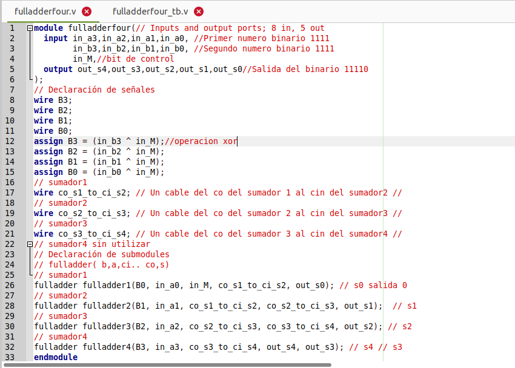

# Simulación de circuitos digitales

## Introduccion
En el informe presentado a continuación se desarrollará la práctica relacionada con la simulación de circuitos digitales, en donde se buscara conocer el potencial del lenguaje de descripción de hardware Verilog en la elaboración de circuitos y en la correspondiente verificación de ellos. Durante el informe se usaran programas de Linux para cada uno de los procesos, empezando por programas como iverilog que permite la simulación de archivos verilog y gtkwave que permite observar los resultados graficamente. Adicionalmente con la ayuda de digital se realizaran los circuitos digitales a partir de compuertas logicas, tablas de verdad y expresiones algebraicas, para acomparar al final los resultados obtenidos.

## Objetivos

1. A partir de la documentación de Digital identificar las capacidades de ésta aplicación, limitaciones, herramientas y ejemplos de uso.

2. Observar de la simulación de un circuito digital:
    * Tabla de verdad
    * Expresión algebraica asociada al circuito
    * Mapa de Karnaugh
    * Simulación
    * Casos de prueba

3. Realizar la simulación del circuito digital con iverilog y gtkwave
    * Describir el circuito digital en verilog
    * Crear el testbench de los casos de prueba
    * Realizar la simulación
    * Observar en gtkwave los resultados de manera gráfica

4. Combinar Digital, iverilog y gtkwave
    * En digital con el circuito anterior
        * Exportar a verilog
        * Crear un testbench con los casos de prueba
    * En iverilog crear la simulación con los archivos generados archivo.v y tb.v0
    * En gtkwave observar los resultados de la simulación

## Procedimiento

En el desarrollo de los circuitos se utilizara Digital, iverilog, gtkwave, yosys y netlistsvg, para cumplir los objetivos propuestos anteriormente. Inicialmente se buscara comprender todo el potencial de la aplicación digital y con lo aprendido se obtendra la tabla de verdad, la expresión algebraica, el mapa de Karnaugh y se realizara la simuación correspondiente con sus casos de prueba. Se desarrollara el circuito en verilog para simularlo con iverilog y con gtkwave. Por ultimo, se comparan los resultados de la simulación del archivo verilog que se obtiene desde digital con iverilog y gtkwave.

Inicialmente se buscara desarrollar un sumador completo (suma de tres bits), con él que se obtendran las simlaciones y los datos propuestos anteriormente.

## Resultados

### Semisumador

El sumador completo se realiza a partir de dos semisumadores que tienen el objetivo de obtener la suma de dos bits en binario.

En el programa digital los semisumadores estan conformados por el circuito que se muestra a continuación:

##### Casos de prueba y gráfico

Se observa que al conectar las entradas a un XOR y a un AND se obtiene a la salida los bits que representan en binario todas las posibles sumas de dos bits, donde co es el bit más significativo y s el menos significativo. Adicionalmente, en la imagen se encuentran simulados los casos de prueba con su respectiva grafica donde se pueden observar las sumas del semisumador.

En el progrma digital se obtiene la tabla de verdad  y la ecuación del semisumador desde las opciones de análisis. En la siguiente imagen se puede observar la tabla de verdad y la ecuación que corresponde a un sumador de dos bits:

##### Tabla de verdad y ecuación

Para observar los mapas de Karnaugh para las salidas del semisumador se utilizo la opción que proporciona la tabla de verdad en la parte superior. Se obtienen dos mapas de karnaugh con la ecuación que representa a cada una de las salidas.

##### Mapa de Karnaugh - co

##### Mapa de Karnaugh - s

Para terminar se obtuvo la imagen del circuito en .png desde las opciones de exportación de digital.

##### Circuito digital

#### Sumador completo

Con el semisumador realizado en su totalidad ahora se desarrolla el sumador completo conectando un semisumador a dos de las entradas y otro semisumador a la entrada que falta y a la salida del bit menos significativo del primer semisumador, con una compuerta OR se revisa si alguno de los bits mas significativos de los semisumadores es un 1 lógico y si es así el bit más significativo de la salida del sumador completo es tambien un 1 lógico, y por ultimo el bit menos significativo del sumador es el bit menos significativo del segundo semisumador.

Se puede observar el circuito en la aplicación digital con los casos de prueba de la suma de tres bits y su gráfico en la siguiente imagen:

##### Casos de prueba y gráfico

Al utilizar el análisis de digital se obtiene la siguiente tabla de verdad del sumador completo:

##### Tabla de verdad

La ecuación de las dos salidas del sumador se obtienen junto con el mapa de karnaugh que los representa:

##### Mapa de Karnaugh - co

##### Mapa de Karnaugh - s

##### Circuito digital

Con iverilog y gtkwave se realizó la simulación del sumador completo a partir del archivo verilog que representa el sumador completo junto con el semisumador y otro archivo verilog que se encarga de las simulaciones.

Al realizar la simulación con iverilog se observa que se cumplen todos los casos de prueba, como se muestra en la imagen:

##### Simulación iverilog

En gtkwave se observan los casos de prueba de forma grafica y como estos cambian dependiendo de la entrada. En la siguiente imagen se observan los resultados obtenidos:

##### Simulacion gtkwave

Con netlistsvg se genera el RTL del sumador completo y se presenta de la siguiente forma:

##### RTL de netlistsvg

Los archivos verilog utilizados para la simulación son:

Diseño del circuito: 

Casos de prueba: 

### Sumador-Restador 
Para la realizacion del sumador restador sera necesario entender cuál será el funcionamiento de este circuito, por tanto es necesario aclarar que este circuito se realizará mediante cuatro sumadores completos, es decir un sumador completo para cada cifra, esto dado a que la suma se realiza dígito a dígito. Para la resta se utilizará el mismo circuito, sin embargo se deberá realizar una modificación de tal forma que el segundo número se reste utilizando complemento a dos, gracias a esto se permitirá realizar una sustracción a partir de la suma del complemento de este número. Para poder realizarlo en digital se partirá a partir de un sumador de 4 bits.
#### Sumador de 4 Bits
Para poder realizar el sumador de 4 bits e digital se realizara uniendo 4 sumadores completos, tal y como se trabajaron anteriormente, y se interconectara el Carry out del cada sumador a el Carry in del anterior, de esta manera, cada vez que al realizar la suma, nos genere un "Carry", este se sumara automaticamente a la siguiente cifra. Es importante denotar que la conexion entre los carrys se debera hacer del Carry out de la cifra menos significativa al de la siguiente cifra mas significativa, y se procedera en ese orden hasta terminar las cifras y obtener un carry out de la cifra mas significativa, en este caso, dado que el sistema solo maneja 4 bits, se dira que el carry out de la cifra mas significativa representara un estado de "Overflow"
(inserte imagen del sumador completo)

#### Sumador restador de 4 bits
Para poder realizar el sumador restador de 4 bits como se explico anteriormente se deberan tener en cuenta varios elementos:
   1. La operacion realizada se realizara entre 2 numeros, A y B de 4 bits cada uno.
   2. Se debe poder cambiar de operacion mediante un bit individual, 1 sera la resta y 0 sera la suma.
   3. Para la resta el numero B se debera restar mediante el complemento a 2.
Teniendo en cuenta esto se realizara la conexion del circuito de la siguiente manera:

(inserte imagen del sumador restador)

En este circuito podemos ver como los bits del numero B estan conectadas a un "XOR", a esta compuerta a su vez esta conectada el bit individual de operacion. La funcion que cumple este "XOR" sera la de invertir el numero B para poder restarlo con el complemento a 2, dado a que esta conectado con el bit de la operacion, cuando la operacion este en 0(suma), el "XOR" dara como salida el mismo valor de salida que el numero B, sin embargo, cuando la operacion se encuentre en 1, la salida sera la inversion del numero B. Ademas, dado a que la operacion tambien esta conectada al "Carry In" del sumador de 4 bits, cuando la operacion sea 1, se sumara 1 al numero B, permitiendo hacer una resta mediante complemento a 2.

##### Comportamiento del Carry Out
El carry out presenta comportamiento diferentes para la suma y la resta, en el caso de la suma el circuito presentara la salida del carry out por defecto como un "0", cuando el circuito presente un estado de overflow, "Carry out" presentara un "1", indicando que se necesitara de otro bit para expresar la salida adecuada.

En el caso de la resta, el carry out presentara un estado de "1" por defecto, indicando que la operacion que se esta realizando es una resta, cuando el resultado sea negativo, la salida generada estara invertida con un "1" adicional, mientras que el carry out pasara a un estado de "0", indicando que el resultado de la resta es negativo.

