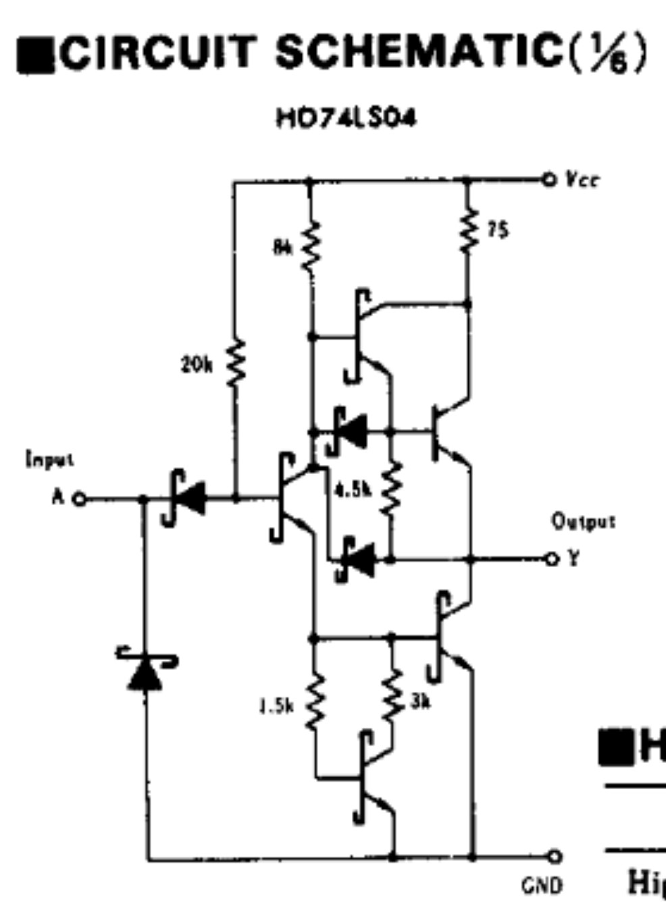
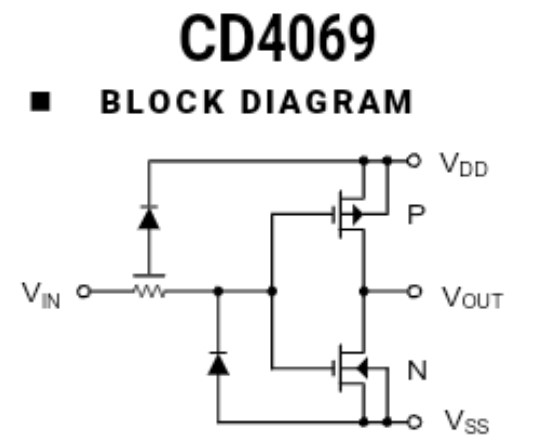

# COMPARACIÓN DE TECNOLOGÍA
## Introduccion
A lo largo de este informe se desarrollará la práctica relacionada con la comparación entre las compuertas lógicas de tipo TTL y CMOS, comparando las características principales de estas y realizando lo respectiva medición de datos mediante simulaciones, para posteriormente compararlas con los resultados obtenidos experimentalmente. Ademas, a partir de estos datos, permitir conocer cuáles son las ventajas y desventajas de cada tipo de estas compuertas y entender en qué casos es más conveniente usar cada una de ellas.

## Objetivos
* Identificar las características de un dispositivo fabricado en diferentes tecnologías.

## Recursos requeridos
* Negador TTL 74LS04
* Negador CMOS CD4069
* Datasheets
  
## Procedimiento

### Parte 1

1. Inicialmente se deben realizar una comparativa del comportamiento de los negadores TTL 74LS04 y  CMOS CD4069, con los datos que encontramos en la Datasheet de cada uno, para lo que vamos a tener en cuenta la tensión de la alimentación, los tiempos que tarda en cambiar su salida dependiendo de los cambios en la entrada y algunos datos adicionales que son de utilidad para en otro momento hacer circuitos y simulaciones que permitan conocer en profundidad la funcionalidad de cada negador y sus diferencias.

Entonces para mostrar los datos se opto por incluir una tabla comparativa.

   | Comparacion Tecnologias         | TTL 74LS04    | CMOD CD4069   |
   | :---                            | :---:         |        :---:  |
   | Tension de alimentación         |       5V      |    3 a 15v    |
   | Tiempo de subida y bajada       | 4.5 y 5 ns    |      20ns     |
   | Tiempo de retardo               | Content Cell  |90 50ns con v+ |
   | Potencia por compuerta          | Content Cell  | Content Cell  |
   | Farm out                        | Content Cell  | Content Cell  |
   | Producto frecuencia y potencia  | Content Cell  | Content Cell  |
   | Compuerta tipo                  |      NOT      |      NOT      |
   | Capacidad corriente salida "1"  |    -0.4 mA    | Content Cell  |
   | Capacidad corriente salida "0"  |      8  mA    | Content Cell  |
   | Salida Open Colector            | Content Cell  | Content Cell  |
   | Nivel de ruido soportado        | Content Cell  | Content Cell  |

   **Negador TTL 74LS04**: 

   **Negador CMOS CD4069**: 

2. Para continuar ahora se deben realizar las simulaciones del comportamiento de los negadores TTL 74LS04 y  CMOS CD4069.

En las primeras simulaciones buscamos comparar las señales de entrada y de salida de los negadores, para observar la precisión que tienen, las caracteristicas de la señal de salida en comparación con la de entrada y que efectos puede llegar a tener en circuitos más complejos. Por lo tanto en las siguientes simulaciones se presentaran circuitos en los que la señal de entrada se modificara a partir de la manipulación de un potenciometro de 10k, y por lo tanto se observaran los rangos del 1 y 0 logicos en el voltaje prensente en un resistor de 10kOhm.

* En esta simulación se empieza con el potenciometro a un valor maximo de 9kΩ en dos circuitos en donde se cambia unicamente el negador de TTL a CMOS.
* 
   
Se observa que el negador TTL al recibir una señal cuadrada de aproximadamente 4.5V se 200ns de subida y de bajada en un tiempo de 2400ns no presenta cambios tan notorios como los del negador CMOS, donde encontamos una señal de salida desfasada con la de entrada, pero con mayor voltaje en la subida de la salida.

* Se observa que al disminuir el valor de la resistencia equivalente del potenciometro el voltaje de entrada tambien disminuye, por lo tanto se logro modificar el voltaje de entrada de los negadores con el potenciometro. En este caso se disminuyo el valor del potenciometro a 6kΩ y se consiguio un voltaje de entrada de aproximadamnete 3V.
* 

En esta simulación se observa una de las grandes diferencias que existe entre los negadores TTL y CMOS, ya que los negadores aunque mantienen un comportamiento bastante similar al de la anterior simulación, presenta un voltaje se salida mmenor el TTL en comparación con el CMOS, ya que el TTL muestra aproximadamente 3.5V y el CMOS más de 4.5V en la salida.

* Ahora que se conoce como funcionan los negadores con una entrada de voltaje correcta, se busco simular el comportamiento de los negadores con un voltaje de entrada de 2.5V, el cual esta en la zona de incertidumbre a partir de los datos del datasheet.
* 

Se obtiene que la señal de voltaje cuadrada sin importa si esta en subida o en baja, para los negadores siempre es una entrada de 0 logico, se espera obtener esta señal pero al mismo tiempo cualquier otra ya que se conoce que en este tipo de compuertas logicas la zona de incertidumbre en la practica impide dar certeza de obtener esta misma señal.

* Para terminar las simulaciones en las que se comparan las señales de voltaje, se busco bajar voltaje de entrada a aproximadamente 0V.
* 

La simulación permitio obtener lo que se esperaba, si la señal cuadrada de voltaje que recibe cualquiera de los negadores es aproximadamente 0V se obtiene el mayor voltaje de salida.

* Para observar el funcionamiento de los negadores en la practica de laboratorio, se desarrollaron los siguientes circuitos simulados en donde se presenta como se comporta un led dependiendo de la señal de entrada. En los circuitos presentados se observan los momentos en los que el led esta encendido y apagado, cuando los dos negadores funcionan correctamente.

* Entrada de aproximadamente 0V

* 
* 

* Salida de aproximadamente 0V

* 
* 

   
   
3. Determinar el circuito equivalente para cada uno de los dispositivos.   
 **Negador TTL 74LS04**:
  * 
 Nos apoyamos en este circuito equivalente para un transistor bjt en saturación:
 
  * 
  
 Cuando se le aplica un 1 lógico:
 
  * 
  
 El transistor 1 npn, se polariza en directo, logrando un aumento de B veces y esa corriente fluirá hacía los transistores de abajo, transistor 3 y 4, los cuales se polarizarán en directo. y en la salida habrá un 0 
 lógico, puesto que cuando conduce el transistor 4, la tensión Vds cae a 0.
 El transistor 2(en amarillo) no conduce ya que su tensión es mucho menor, a su vez los diodos encerrados ayudan a dar una respuesta más rapida para el cambio del estado lógico. 
 
 Cuando se le aplica un 0 lógico:

   * 
  
 El transistor 1 no se polariza porque la tensión vcc desemboca a A, reduciendo la tensión que puede haber en el gate del transistor 1, por lo que no conducirá.
 Por otro lado, como el transistor 1 no conduce, el drain mantendrá una tensión que exitará el gate del transistor 2 y luego el transistor 3, donde el transistor 3 en el source mantendrá una tensión que será un 1 
 lógico, ya que los demás transistores al no estar exitados se comportan como circuito abierto, logrando así el nivel requerido. 

 **Negador CMOS CD4069**: 
  * 

 Para su análisis digital, quitamos los diodos de protección:

  * 
 
 Se van a presentar dos casos, así que vamos a definir las variables que usaremos para simplificar el análisis:
 
  * Vcc = 5
  * Vt = |2|

 CASO 1: Entrada(ALTO) = Vdd.
 
   * 
   
    * PMOS:
      Vgs = (Vdd-Vdd) <= Vt
      0 <= (-2)
      Fuente y drenador se aislan, el transistor pmos no conduce.
      
    * NMOS:
      Vgs = (Vdd - 0)  >= Vt
      Vdd >= Vt
      5 >= 2
      Fuente y drenador se unen mediante un canal, el transistor nmos conduce.

 CASO 2: Entrada(BAJO) = 0.
 
   * 
    
    * PMOS:
      Vgs = (0-Vdd) <= Vt
      (-5) <= (-2)
      Fuente y drenador se unen mediante un canal, el transistor pmos conduce.
      
    * NMOS:
      Vgs = (0 - vdd)  >= Vt
      -Vdd >= Vt
      -5 >= 2
      Fuente y drenador se aislan, el transistor nmos no conduce.

   

  

4. Conclusión

A partir de las simulaciones se llega a comprender que los negadores TTL 74LS04 y CMOS CD4069, presentan diferencias en varias de sus caracteristicas y que estos cambios son importantes en el desarrollo de circuitos más complejos. Inicialmente se observo que el negador TTL es más preciso al invertir la señal ya que no se observa un desface tan notorio como en el CMOS, aunque se debe recalcar que el negador CMOS al invertir las señales de 0 logico, permite obtener salidas de mayor voltaje en comparación que el TTL, lo que ayuda a diseñar circuitos con menos perdidas energeticas y de mayor tamaño.
